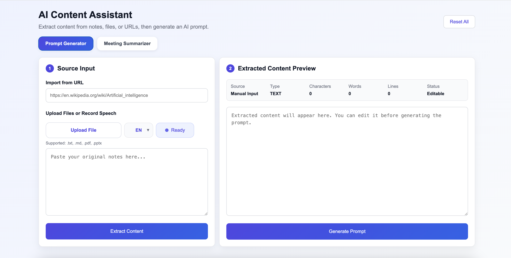
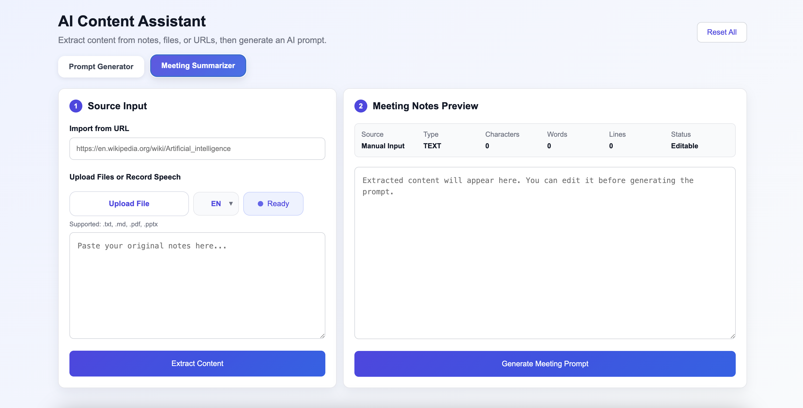
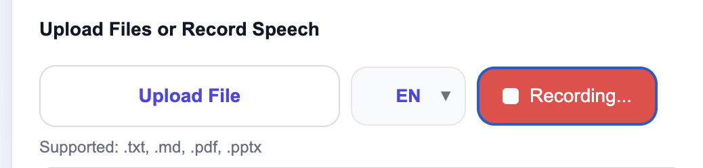

# AI Content Assistant

A modern Flask-based AI content extraction, transcription, and prompt generation tool.

AI Content Assistant helps users collect information from files, webpages, manual notes, or live speech input, then transform the content into structured prompts for ChatGPT and other Large Language Models (LLMs).

---

# Demo

<p align="center">
  
</p>

A complete workflow demonstration:

- Import content
- Review extracted text
- Edit and refine content
- Generate structured prompts

---

# Key Features

### File Import

Supports:

- TXT
- Markdown
- PDF
- PowerPoint (.pptx)

### URL Content Extraction

Paste a webpage URL and automatically extract readable content.

### Editable Preview

Review and modify extracted content before generating prompts.

### Multi-Language Speech-to-Text

Supports real-time browser transcription:

- English
- Japanese
- Chinese
- Korean

### Prompt Generation

Generate structured prompts for:

- Learning notes
- Research materials
- Meeting records
- AI-assisted workflows

---

# Screenshots

## Home Page

<p align="center">
  
</p>

The main dashboard provides a clean workflow for importing, extracting, and generating AI prompts.

---

## Meeting Summarizer Mode

<p align="center">
  
</p>

Switch between:

- Prompt Generator
- Meeting Summarizer

to support different use cases.

---

## Real-Time Speech Recognition

<p align="center">
  
</p>

Built-in browser speech recognition allows users to dictate content directly into the application.

Supported languages:

- English
- Japanese
- Chinese
- Korean

---

# Editable Content Workflow

Before generating prompts, users can:

- Remove unnecessary content
- Correct recognition errors
- Rewrite extracted text
- Improve prompt quality

This provides much greater control over the final AI output.

---

# Workflow

```text
Import Content
      ↓
Extract Content
      ↓
Review & Edit Content
      ↓
Generate Prompt
      ↓
Use in ChatGPT / LLMs
```

---

# Tech Stack

## Backend

- Python
- Flask
- BeautifulSoup4
- PyPDF
- python-pptx

## Frontend

- HTML5
- CSS3
- JavaScript
- Web Speech API

---

# Version History

### V1 — Initial Prompt Generator

Basic prompt generation from manually entered text.

### V2 — Multi-file Support

Added support for importing content from local files.

### V3 — Copy Function

Introduced one-click prompt copy functionality.

### V4 — Flask Web Interface

Migrated from a command-line application to a browser-based workflow.

### V5 — TXT / Markdown Support

Added TXT and Markdown file upload support.

### V6 — PDF Import Support

Added PDF text extraction using PyPDF.

### V7 — PowerPoint Import Support

Added PowerPoint (.pptx) text extraction.

### V8 — URL Content Extraction

Added webpage scraping and automatic content extraction.

### V8.5 — Dashboard UI Redesign

Redesigned the application into a modern SaaS-style dashboard.

### V8.5.1 — Live Statistics & Editable Preview

Added:

- Source information display
- File type detection
- Character counter
- Word counter
- Line counter
- Editable preview area

### V9 — Dual Mode Architecture

Introduced:

- Prompt Generator Mode
- Meeting Summarizer Mode

### V10 — Multi-Language Speech-to-Text

Added:

- Real-time speech recognition
- Language selector
- Recording controls
- Browser transcription
- Meeting workflow enhancement

---

# Future Roadmap

### V11 — OCR Image Recognition

Extract text from:

- Screenshots
- Photos
- Scanned documents

### V12 — Audio / Video File Transcription

Support uploaded:

- MP3
- WAV
- M4A
- MP4

### V13 — OpenAI API Integration

Generate summaries and prompts directly using AI APIs.

### V14 — AI Meeting Analysis

Automatically generate:

- Meeting summaries
- Action items
- Key decisions
- Discussion highlights

### V15 — Export Features

Export generated content to:

- TXT
- Markdown
- PDF
- DOCX

---

# License

MIT License